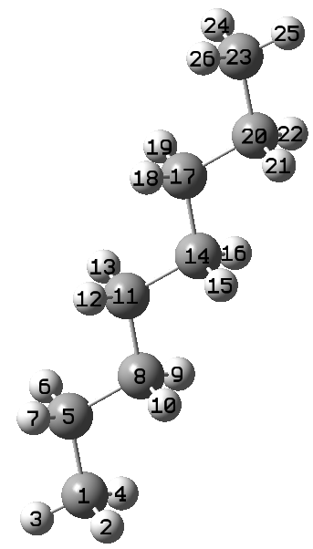
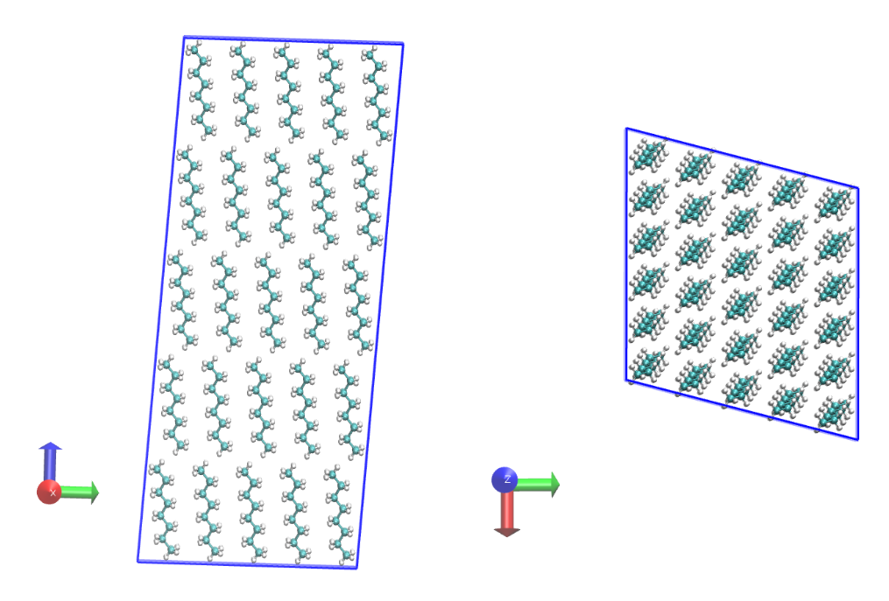

# Example 1: Creation of a n-octane crystal

**The files to run this example are available in the [examples](../examples/01-n-octane_103191_replicate/) folder inside the distribution**

Two inputs files are required to run the program:

* A pdb file containing the molecule to be replicated
* A xml file with force field parameters. The basic format is described [here](https://foyer.mosdef.org/en/stable/topic_guides/smarts.html)

The pdb file used in this example is  [103191_noctane_order_cryst.pdb](../examples/01-n-octane_103191_replicate/103191_noctane_order_cryst.pdb). It is recommended to give an order to the atoms as shown in the figure:

<p align="center">
    
</p>

It is also recommend that the CRYST1 flag be present in the pdb file with the information of box containing the molecule.

```bash
CRYST1    4.123    4.686   10.974  85.06  83.72  75.10 P -1           1
```

If this value is in the pdb file the options --boxlength and --boxangle are ignored.
To create a system replicated 3x2x2 using OPLS force field.

```bash
replicate_polymer -p 103191_noctane_order_cryst.pdb -f ../../forcefields/oplsaa.xml --images 3 2 2
```

This produces the following files

```bash
103191_noctane_order_cryst_replicate.gro   --> GRO file for GROMACS
103191_noctane_order_cryst_replicate.pdb   --> PDB file
103191_noctane_order_cryst_replicate.top   --> Top file for GROMACS
Info.log                                   --> Output file

```

The LAMMPS files can be produced by the following command:

```bash
replicate_polymer -p 103191_noctane_order_cryst.pdb -f ../../forcefields/oplsaa.xml --images 6 5 5--engine lammps
```

```bash
103191_noctane_order_cryst_replicate.lmp   --> LAMMPS data file
103191_noctane_order_cryst_replicate.inp   --> LAMMPS keywords template
```

The result is shown in the figure:

<p align="center">
    
</p>

In the folders 99-GROMACS_INP_MIN_NVT and 99-LAMMPS_INP_MIN_NVT, you can find input files to run short simulations in GROMACS and LAMMPS.