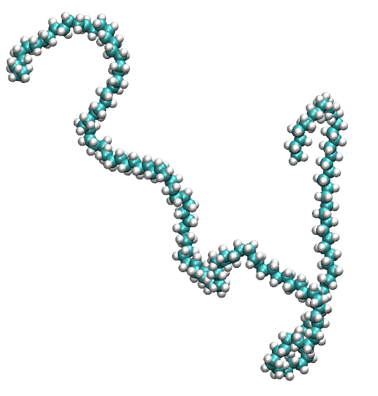
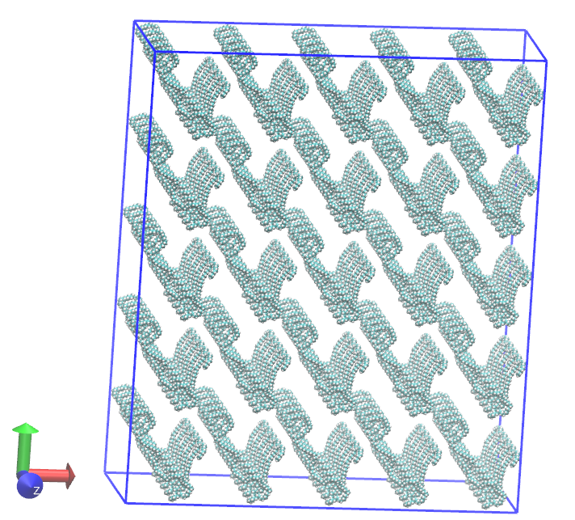
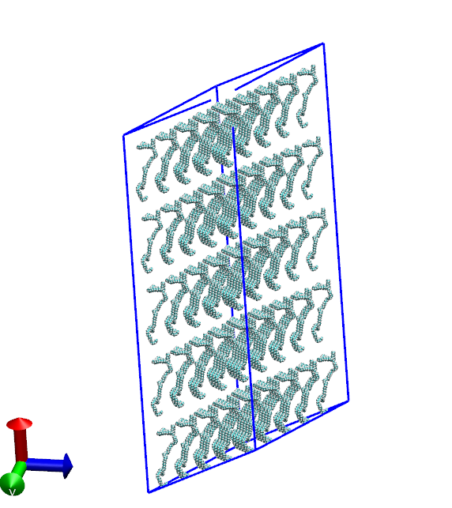

# Example 2: Creation of a simulation box with a polymer chain

Two inputs files are required to run the program: 

* A pdb file containing the molecule to be replicated
* A xml file with force field parameters. The basic format is described [here](https://foyer.mosdef.org/en/stable/topic_guides/smarts.html)

The pdb file used in this example is  [here](../examples/05-C150_amorphous_replicate_5x5x2/02-LAMMPS_amorphous/last.pdb). It is recommended to give an order to the atoms. The seed molecule is shown in the figure:

<p align="center">
    
</p>

In this case, the CRYST1 flag is not present in the pdb file rather `replicate_polymer` make a guess of the box length taken into account the maximun and minimum distances

To create a system replicated 5x5x% using OPLS force field.

```bash 
replicate_polymer -p ../02-LAMMPS_amorphous/last.pdb -f ../../../forcefields/oplsaa.xml --images 5 5 5 --engine lammps
```

This produces the following files

```bash
Info.log            --> Output file
last_replicate.gro  --> GRO file for GROMACS
last_replicate.inp  --> LAMMPS keywords template
last_replicate.lmp  --> LAMMPS data file
last_replicate.pdb  --> PDB file
last_replicate.top  --> Top file for GROMACS
```

The result is shown in the figure:
<p align="center">
    
</p>

The length and shape of the box can be give in the command line as:

```bash
replicate_polymer -p ../02-LAMMPS_amorphous/last.pdb -f ../../../forcefields/oplsaa.xml --images 5 5 5 --engine lammps --boxlength 8.0 8.0 3.0 --boxangle 65.0 60.0 70.0

```

Resulting in:
<p align="center">
    
</p>