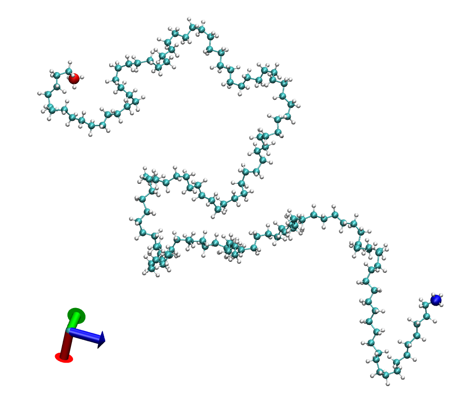
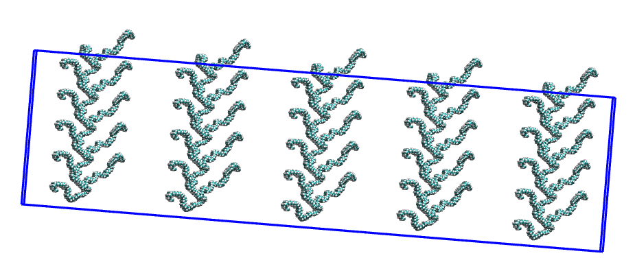
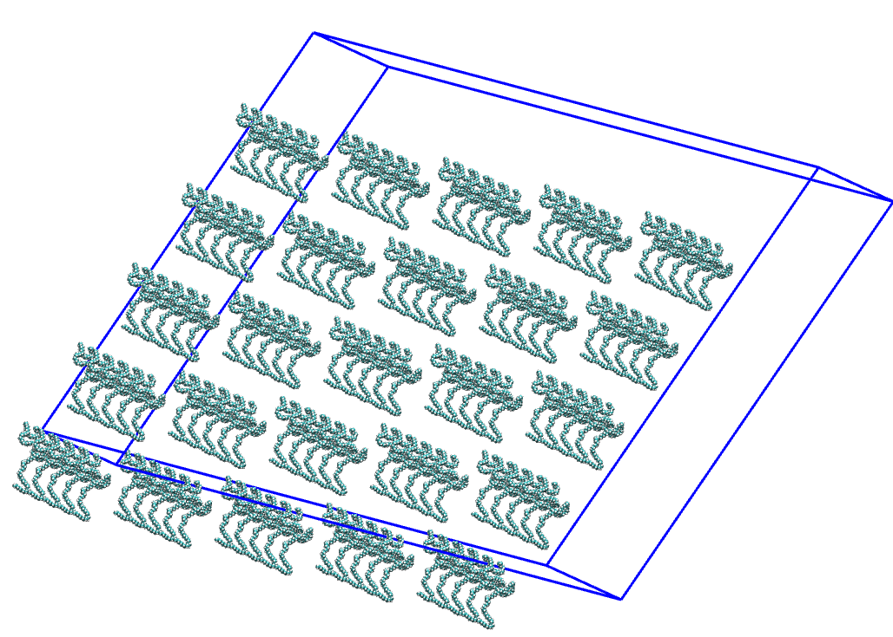

# Example 2: Creation of a simulation box with a polymer chain

**The files to run this example are available in the [examples](../examples/02-C150_onefolded_replicate_5x5x5/) folder inside the distribution**

Two inputs files are required to run the program:

* A pdb file containing the molecule to be replicated
* A xml file with force field parameters. The basic format is described [here](https://foyer.mosdef.org/en/stable/topic_guides/smarts.html)
* To order the atoms and type the residues, two files more are required: a file with information of the head and tail atoms [C150_amorphous_headtail.dat](../examples/02-C150_amorphous_singlechain/C150_amorphous_headtail.dat) and other with the residue information [C150_amorphous_residues.dat](../examples/02-C150_amorphous_singlechain/C150_amorphous_residues.dat)

The pdb file used in this example is  [here](../examples/02-C150_amorphous_singlechain/C150_amorphous.pdb).

It is recommended to order the atoms. This can be accomplished using the Topology library. The Topology library is installed before to install the Replicate_Polymer package. The following [python script](../examples/02-C150_amorphous_singlechain/01-topology_script.py) can be used.

```python
source <Path_to_activate_topology_library>
python 01-topology_script.py
```

<br>
<details>
  <summary>Click to expand the Python Script</summary>

```python
import datetime
from topology.readmol.readxsdformat import ReadXsdFormat
from topology.readmol.readpdbformat import ReadPdbFormat
import utils

filename = "./C150_amorphous.pdb"
pattern = "C150_amorphous_order"
headinfo_file = "./C150_amorphous_headtail.dat"
residueinfo_file = "./C150_amorphous_residues.dat"

# Logger
filelog = pattern+".log"
log = utils.init_logger("Output", fileoutput=filelog, append=False, inscreen=True)
m = "\n\t***************** BUTANE 1 chain *****************"
print(m) if log is None else log.info(m)
now = datetime.datetime.now().strftime("%d-%m-%Y %H:%M:%S")
log.info("\t\tStarting: \t {}\n".format(now))

# Create the xsd object
now = datetime.datetime.now().strftime("%d-%m-%Y %H:%M:%S")
m = "\t\t Reading {}...({})".format(filename, now)
obj = ReadPdbFormat(filename)
print(m) if log is None else log.info(m)

# Write pdb file
now = datetime.datetime.now().strftime("%d-%m-%Y %H:%M:%S")
m = "\t\t Writing pdb file...({})".format(now)
print(m) if log is None else log.info(m)
filenamepdb = "{}.pdb".format(pattern)
obj.write_pdb(filename_pdb=filenamepdb, separate_chains=False)

# Renumber PDB
now = datetime.datetime.now().strftime("%d-%m-%Y %H:%M:%S")
m = "\t\t Read PDB and renumber pdb file...({})".format(now)
print(m) if log is None else log.info(m)
pdb = ReadPdbFormat(filenamepdb)
head_atoms, tail_atoms = pdb.read_head_tail_info(headinfo_file)
test = pdb.write_renumber_pdb(head_idx_atom=head_atoms, tail_idx_atom=tail_atoms)

# Assign residues PDB
filenamepdb=pattern+"_renumber.pdb"
now = datetime.datetime.now().strftime("%d-%m-%Y %H:%M:%S")
m = "\t\t Read PDB and assign residues...({})".format(now)
print(m) if log is None else log.info(m)
pdb_new = ReadPdbFormat(filenamepdb)
pdb_new.assign_residues_chains(residueinfo_file)

# Logger
now = datetime.datetime.now().strftime("%d-%m-%Y %H:%M:%S")
log.info("\n\t\tFinishing: \t {}\n".format(now))
m = "\t============== END   ==============================="
print(m) if log is None else log.info(m)
```

</details>
<br><br>

The file [C150_amorphous_residues.pdb](../examples/02-C150_amorphous_singlechain/C150_amorphous_residues.pdb) has assigned the residue names, backbone information and the atoms are ordered following the graph from the head to the tail atoms.

The seed molecule is shown in the figure (the head and tail atoms are in blue and red colors, respectively):

<p align="center">
    
</p>


If the CRYST1 flag is not present in the pdb file **replicate_polymer** make a guess of the box length taken into account the maximun and minimum distances

To create a system replicated 5x5x5 using OPLS force field.

```bash 
replicate_polymer -p ../02-LAMMPS_amorphous/last.pdb -f ../../../forcefields/oplsaa.xml --images 5 5 5 --engine lammps
```

This produces the following files

```text
Info.log                                     --> Output file
C150_amorphous_residues_replicate.gro        --> GRO file for GROMACS
C150_amorphous_residues_replicate_clean.inp  --> LAMMPS keywords template
C150_amorphous_residues_replicate_clean.lmp  --> LAMMPS data file
C150_amorphous_residues_replicate.pdb        --> PDB file
C150_amorphous_residues_replicate.top        --> Top file for GROMACS
```

The result is shown in the figure:
<p align="center">
    
</p>

The length and shape of the box can be give in the command line as:

```bash
cp C150_amorphous_residues.pdb C150_amorphous_residues_boxinfo.pdb

replicate_polymer -p C150_amorphous_residues_boxinfo.pdb -f ../../forcefields/oplsaa.xml --images 5 5 5 --engine lammps --boxlength 8.0 8.0 3.0 --boxangle 65.0 60.0 70.0
```

Resulting in:
<p align="center">
    
</p>