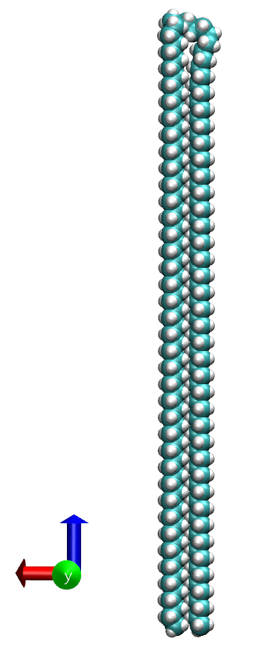
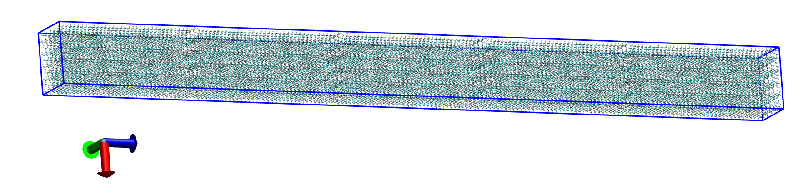

# Example 3: Creation of a pseudo-crystal with a folded chain

**The files to run this example are available in the [examples](../examples/02-C150_onefolded_replicate_5x5x5/) folder inside the distribution**

Two inputs files are required to run the program: 

* A pdb file containing the molecule to be replicated
* A xml file with force field parameters. The basic format is described [here](https://foyer.mosdef.org/en/stable/topic_guides/smarts.html)
* To order the atoms and type the residues, two files more are required: a file with information of the head and tail atoms [C150_1fold_headtail.dat](../examples/03-C150_onefolded_replicate_5x5x5/C150_1fold_headtail.dat) and other with the residue information [C150_1fold_headtail.dat](../examples/03-C150_onefolded_replicate_5x5x5/C150_1fold_residues.dat)

The pdb file used in this example is  [here](../examples/03-C150_onefolded_replicate_5x5x5/C150_1fold_initial.pdb).

It is recommended to order the atoms. This can be accomplished using the Topology library. The Topology library is installed before to install the Replicate_Polymer package. The following [python script](../examples/02-C150_amorphous_singlechain/01-topology_script.py) can be used

```python
source <Path_to_activate_topology_library>
python 01-topology_script.py
```

<br>
<details>
  <summary>Click to expand the Python Script</summary>

```python
import datetime
from topology.readmol.readxsdformat import ReadXsdFormat
from topology.readmol.readpdbformat import ReadPdbFormat
import utils

filename = "./C150_amorphous.pdb"
pattern = "C150_amorphous_order"
headinfo_file = "./C150_amorphous_headtail.dat"
residueinfo_file = "./C150_amorphous_residues.dat"

# Logger
filelog = pattern+".log"
log = utils.init_logger("Output", fileoutput=filelog, append=False, inscreen=True)
m = "\n\t***************** BUTANE 1 chain *****************"
print(m) if log is None else log.info(m)
now = datetime.datetime.now().strftime("%d-%m-%Y %H:%M:%S")
log.info("\t\tStarting: \t {}\n".format(now))

# Create the xsd object
now = datetime.datetime.now().strftime("%d-%m-%Y %H:%M:%S")
m = "\t\t Reading {}...({})".format(filename, now)
obj = ReadPdbFormat(filename)
print(m) if log is None else log.info(m)

# Write pdb file
now = datetime.datetime.now().strftime("%d-%m-%Y %H:%M:%S")
m = "\t\t Writing pdb file...({})".format(now)
print(m) if log is None else log.info(m)
filenamepdb = "{}.pdb".format(pattern)
obj.write_pdb(filename_pdb=filenamepdb, separate_chains=False)

# Renumber PDB
now = datetime.datetime.now().strftime("%d-%m-%Y %H:%M:%S")
m = "\t\t Read PDB and renumber pdb file...({})".format(now)
print(m) if log is None else log.info(m)
pdb = ReadPdbFormat(filenamepdb)
head_atoms, tail_atoms = pdb.read_head_tail_info(headinfo_file)
test = pdb.write_renumber_pdb(head_idx_atom=head_atoms, tail_idx_atom=tail_atoms)

# Assign residues PDB
filenamepdb=pattern+"_renumber.pdb"
now = datetime.datetime.now().strftime("%d-%m-%Y %H:%M:%S")
m = "\t\t Read PDB and assign residues...({})".format(now)
print(m) if log is None else log.info(m)
pdb_new = ReadPdbFormat(filenamepdb)
pdb_new.assign_residues_chains(residueinfo_file)

# Logger
now = datetime.datetime.now().strftime("%d-%m-%Y %H:%M:%S")
log.info("\n\t\tFinishing: \t {}\n".format(now))
m = "\t============== END   ==============================="
print(m) if log is None else log.info(m)
```

</details>
<br><br>

<p align="center">
    
</p>

To create a system replicated 5x5x% using OPLS force field.

```bash
replicate_polymer  -p C150_1fold_residues.pdb -f ../../forcefields/oplsaa.xml --images 5 5 5 -e lammps
```

This produces the following files

```bash
C150_1fold_residues_replicate.gro       --> GRO file for GROMACS
C150_1fold_residues_replicate_clean.inp --> LAMMPS keywords template
C150_1fold_residues_replicate_clean.lmp --> LAMMPS data file
C150_1fold_residues_replicate.pdb       --> PDB file
C150_1fold_residues_replicate.top       --> Top file for GROMACS
Info.log                                --> Output file
```

The result is shown in the figure:
<p align="center">
    
</p>

