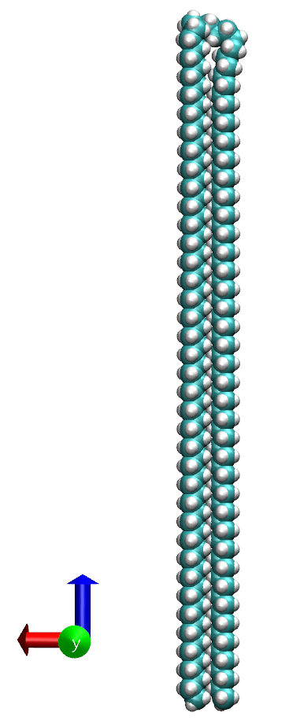
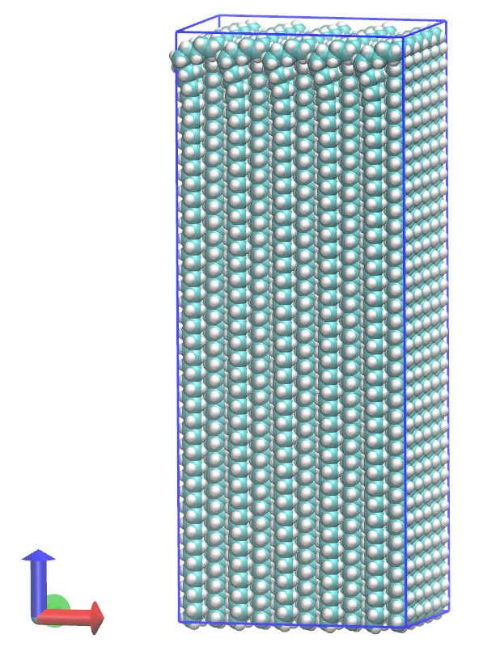

# Example 3: Creation of a pseudo-crystal with a folded chain

Two inputs files are required to run the program: 

* A pdb file containing the molecule to be replicated
* A xml file with force field parameters. The basic format is described [here](https://foyer.mosdef.org/en/stable/topic_guides/smarts.html)

The pdb file used in this example is  [here](../examples/05-C150_amorphous_replicate_5x5x2/02-LAMMPS_amorphous/last.pdb). It is recommended to give an order to the atoms. The seed molecule is shown in the figure:

<p align="center">
    
</p>

In this case, the CRYST1 flag is not present in the pdb file rather `replicate_polymer` make a guess of the box length taken into account the maximun and minimum distances

To create a system replicated 5x5x% using OPLS force field.

```bash 
replicate_polymer  -p ./data/C150_1fold_initial_new.pdb -f ../../forcefields/oplsaa.xml --images 5 5 1 -e lammps
```

This produces the following files

```bash
C150_1fold_initial_new_replicate.gro --> GRO file for GROMACS
C150_1fold_initial_new_replicate.inp --> LAMMPS keywords template
C150_1fold_initial_new_replicate.lmp --> LAMMPS data file
C150_1fold_initial_new_replicate.pdb --> PDB file
C150_1fold_initial_new_replicate.top --> Top file for GROMACS
Info.log                             --> Output file
```

The result is shown in the figure:
<p align="center">
    
</p>

