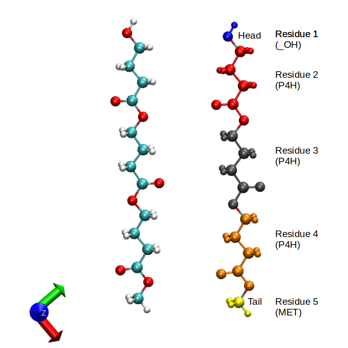
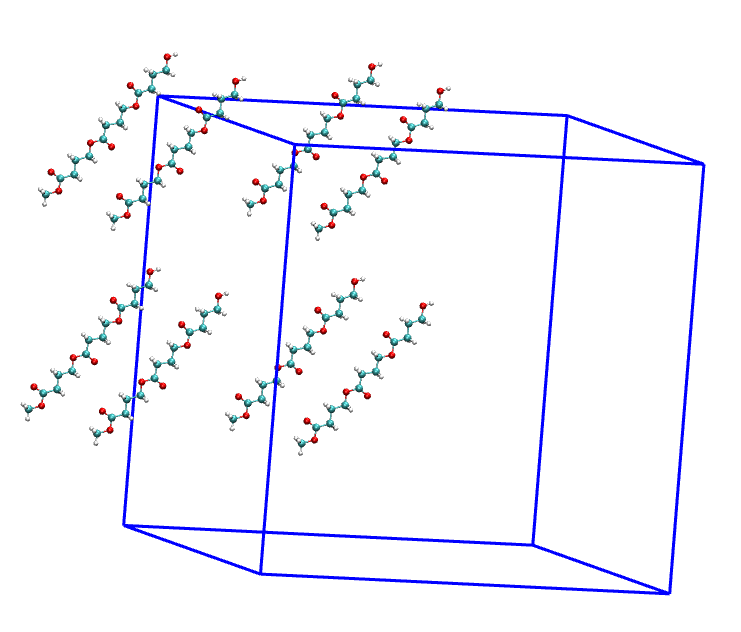
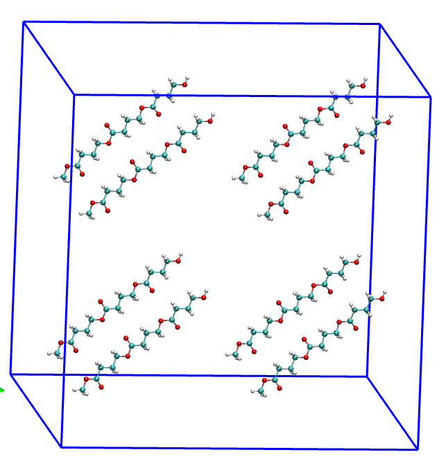

# Example 4: Replicate a trimer P4HB from a single chain (OPLS)

**The files to run this example are available in the [examples](../examples/04-Trimer_P4HB_OPLSAA/) folder inside the distribution**

Two inputs files are required to run the program: 

* A pdb file containing the molecule to be replicated
* A xml file with force field parameters. The basic format is described [here](https://foyer.mosdef.org/en/stable/topic_guides/smarts.html)
* To order the atoms and type the residues, two files more are required: a file with information of the head and tail atoms [TrimerP4HB_headtail.dat](../examples/04-Trimer_P4HB_OPLSAA/TrimerP4HB_headtail.dat) and other with the residue information [TrimerP4HB_residues.dat](../examples/04-Trimer_P4HB_OPLSAA/TrimerP4HB_residues.dat)

The pdb file used in this example is  [here](../examples/04-Trimer_P4HB_OPLSAA/00-Inital_trimerP4HB.pdb).

Run the python script [01-topology_script.py](../examples/04-Trimer_P4HB_OPLSAA/01-topology_script.py) to order the atoms and to assign the residue names.

<p align="center">
    
</p>

Now, apply the **replicate_polymer**:

```bash
replicate_polymer -p TrimerP4HB_residues.pdb -f ../../forcefields/oplsaa.xml --images 2 2 2  -e lammps --boxlength 2.3 2.3 2.3
```

<p align="center">
    
</p>

If you want to center the molecules, you can use the editconf in GROMACS

```bash
gmx editconf -f TrimerP4HB_residues_replicate.gro -c -o TrimerP4HB_residues_replicate_center.gro
```

<p align="center">
    
</p>
