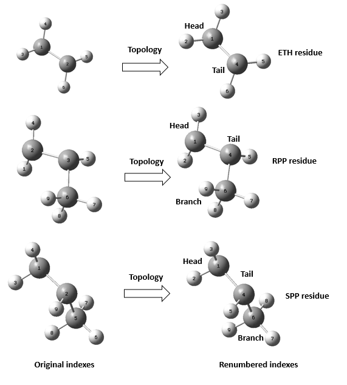

# Generate polymer blends

This tutorial describes how to generate a polymer blend of PE and iPP using the following tools:

 - Topology
 - Replicate_polymer

## Step 01: Generate all monomers in format PDB.

The initial step involves the generation of monomers. In this tutorial, Materials Studio Software has been employed to create three distinct monomers, namely **C1_methyl.xsd**, **C2_ethylene.xsd**, **C2_propene_R.xsd** and **C2_propene_S.xsd**. Following the monomer generation, the next crucial task is to transform these monomers from XSD files to PDB files.

To accomplish this conversion, the recommended tool is the Topology tool. The Topology tool facilitates the seamless transformation of molecular structures, allowing you to convert XSD files into the widely-used PDB format. This conversion is essential for further analyses and simulations, ensuring compatibility with various molecular modeling and visualization tools.


```bash
# Load the environement python where topology is installed
conda deactivate
source ~/Programacion/sandboxes/sandbox_common/bin/activate
topology_cmd -i C2_ethylene.xsd
```

The process generates a topology.pdb from the **C2_ethylene.xsd** file. By visualizing this file, you can extract important information such as the indices for the head and tail atoms, along with the number of atoms in each residue. To accomplish this task, the recommended tool is VMD (Visual Molecular Dynamics).

Furthermore, it is crucial to perform atom renumbering and assign residue names to the generated PDB files. This step ensures proper organization and identification of atoms and residues, contributing to the accuracy and clarity of subsequent analyses and simulations.

To successfully complete this task, preparation of two essential files is required. The first file, named 'headfile.dat,' contains information regarding the head and tail atoms. For the specific formats of these files, please refer to the Topology tool's manual. However, you can conveniently find examples in the following files: [headtail](./00-INPUTS/STEP-01/C2_ethylene_headtail.dat) and [residues](./00-INPUTS/STEP-01/C2_ethylene_residues.dat). These examples serve as references to guide you in creating the necessary input files for the Topology tool.

After creating the required files, proceed to generate the renumbered files using the following commands:

```bash
topology_cmd -i C1_methyl.xsd   -r C1_methyl_headtail.dat   -a C1_methyl_residues.dat   -p C1_methyl
topology_cmd -i C2_ethylene.xsd -r C2_ethylene_headtail.dat -a C2_ethylene_residues.dat -p C2_ethylene
topology_cmd -i C2_propene_R.xsd -r C2_propene_R_headtail.dat  -a C2_propene_R_residues.dat  -p C2_propene_R
topology_cmd -i C2_propene_S.xsd -r C2_propene_S_headtail.dat  -a C2_propene_S_residues.dat  -p C2_propene_S
```

Inspect the results by visualizing the files **C2_methyl_residues.pdb**, **C2_ethylene_residues.pdb**, **C2_propene_R_residues.pdb** and **C2_propene_S_residues.pdb**. Additionally, gro and psf files have been generated.





## Step 02: Apply force field parameters to the monomers.

The aim of this step is to apply Trappe-Toxwaerd_UA parameters to the monomers using the **replicate_polymer** tool. 

